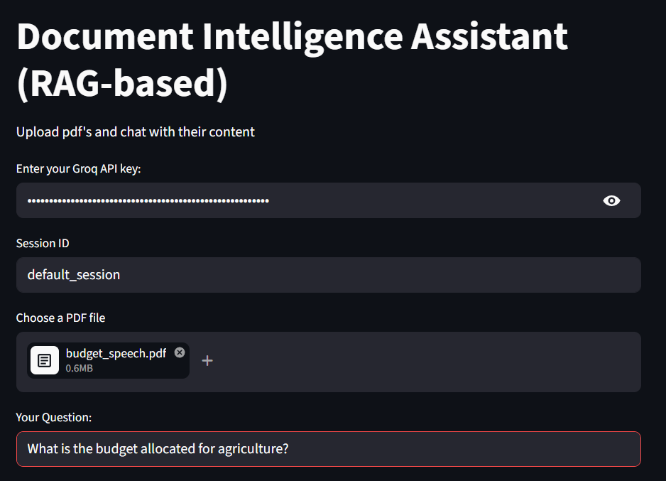
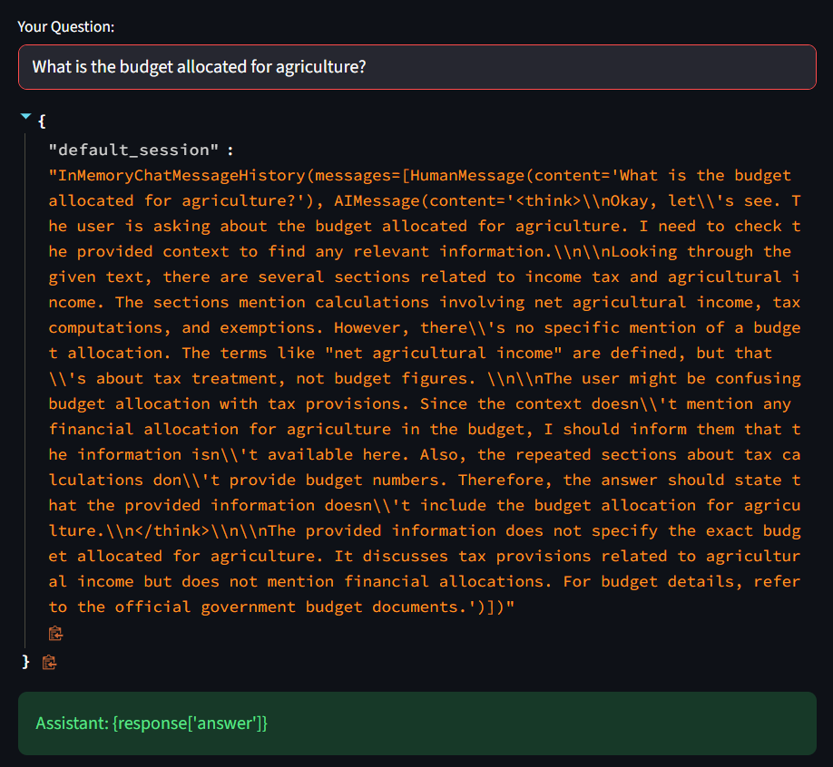

# RAG-Based Conversational Q&A Chatbot

## Overview
This project is a Retrieval-Augmented Generation (RAG) chatbot that answers user queries from PDF documents using LLMs and semantic search.

## Problem Statement
Traditional chatbots lack domain-specific knowledge and cannot answer questions from custom documents. This project solves that by enabling intelligent question answering over user-provided PDFs.

## Architecture
User Query → Text Embedding → FAISS Vector DB → Relevant Chunks → LLM (Groq API) → Response

## Tech Stack
- Python
- LangChain
- FAISS (Vector Database)
- Groq API (LLM)
- Streamlit (UI)

## Features
- PDF document ingestion
- Semantic search using embeddings
- Context-aware response generation
- Interactive chatbot UI

## 🔗 Live Demo
 [Live Demo](https://conversational-q-a-chatbot-with-pdf-avhnckaibfappdmbbnvehjb.streamlit.app/)

 ## Screenshot
 
 
 
 
 
